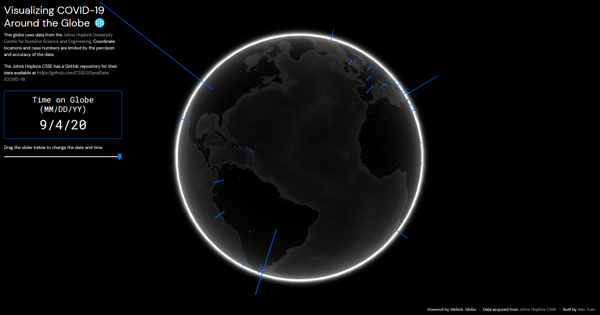

# Visualizing COVID-19 Around the Globe 🌐

## [👉 DEMO](https://coronaglobe.alexyuan.me)

### I wanted a look at COVID-19 data in a cool way so I built this "coronaglobe".

I actually built this around February/March of 2020 but I kinda forgot about it. Im deciding to release it now.

This globe uses data from the [Johns Hopkins University Center for Systems Science and Engineering](https://systems.jhu.edu/) and you can find their GitHub repository at [https://github.com/CSSEGISandData/COVID-19](https://github.com/CSSEGISandData/COVID-19).

### How to use this thing

The process of generating data for the map is done in the `data-processor` folder. There is a `time_series_covid19_confirmed_global.csv` file which you need to replace with the most current version of the data [https://github.com/CSSEGISandData/COVID-19/blob/master/csse_covid_19_data/csse_covid_19_time_series/time_series_covid19_confirmed_global.csv](https://github.com/CSSEGISandData/COVID-19/blob/master/csse_covid_19_data/csse_covid_19_time_series/time_series_covid19_confirmed_global.csv). I will try to update this repository as often as possible but I'm pretty busy.

After that, run `python3 generate_data.py` in the `data-processor` directory. It will run a script which transforms the John Hopkins data into the form which Google Javascript WebGL Globe Toolkit will be able to interpret.

Now go to your browser and open the `index.html` file. It should work and give you something that looks like this:

### Why is the code so bad?

I wrote it in a rush so I could put it on my University of Waterloo application. Feel free to build on it or send a pull request.

Thanks to John Hopkins for making all of data publicly accessible.